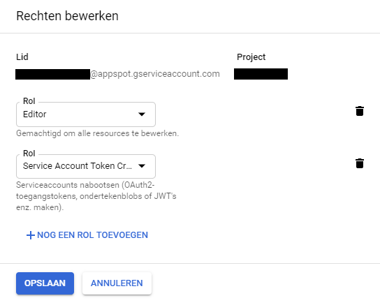

## Table of Contents
- [Setup](#setup)
- [Usage](#usage)

<a name="setup"/>

## Setup - How to use the admin impersonation feature.
You may have to use the '[IAM and admin](https://console.cloud.google.com/project/_/iam-admin)' section of Google Clout Platform Console to grant the necessary permissions.
Search for the [Your project name]@appspot.gserviceaccount.com and check if it has the following role active 'Service Account Token Creater'.
<p align="center">
  
</p>
If It doens't add the 'Service Account Token Creater'.
<p align="center">
  
</p>

---

After doing this add the following firebase function to your application. Don't forget to deploy the function with `firebase deploy --only functions:createUserToken`
```typescript
exports.createUserToken = functions.https.onRequest((req, res) =>  createUserToken(req, res))

export function createUserToken(req: functions.https.Request, res: functions.Response) {
  const uid: string = req.body['uid']
  admin.auth().createCustomToken(uid)
    .then((customToken: string) => {
      // Send token back to client
      res.status(200).send(customToken)
    })
    .catch((e: any) => console.log(e));
};
```
<a name="usage"/>

## Usage

```html
<ng-admin-settings></ng-admin-settings>
```


